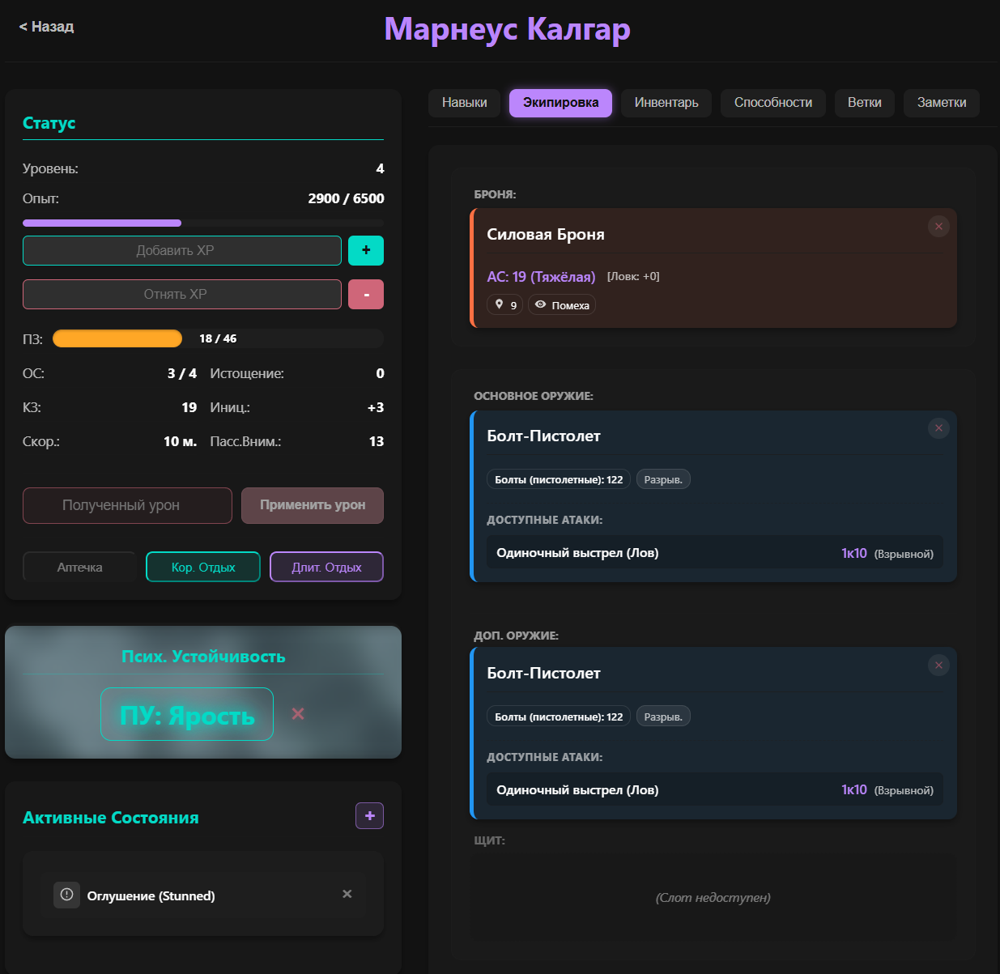

# ✨ Осознание: Приложение-помощник ✨

<p align="center">
  
  
  
  
  
  </p>

> **Веб-приложение, разработанное для упрощения управления персонажами и игровым процессом в настольной ролевой игре "Осознание".**

Помощник позволяет игрокам детально отслеживать характеристики, инвентарь и способности своих персонажей, рассчитывать результаты действий, управлять состоянием (включая уникальную механику **Психологической Устойчивости**) и взаимодействовать с другими игроками в реальном времени через лобби и чат.

---

<p align="center">
  <em>Интерфейс приложения в действии:</em><br><br>
  
</p>

---

## 🚀 Ключевые Возможности

Этот раздел выделяет основные функции приложения:

* **👤 Персонаж под Контролем:**
    * **Создание:** Гибкая настройка с распределением очков 18 навыков и веток развития.
    * **Статы:** Отслеживание ПЗ, Макс. ПЗ, Уровня, Опыта и авто-расчет КЗ, Инициативы, Скорости, Модификаторов.
    * **Прокачка:** Система Level Up с выбором улучшений.
    * **Визуализация:** Информативный лист персонажа с удобным доступом ко всем параметрам.

* **🎲 Механики "Осознания" в Цифре:**
    * **ПУ:** Уникальная **двухфазная система** отображения Псих. Устойчивости с **анимированным фоном** при ПЭ/НЭ. Включает проверки и триггеры эмоций.
    * **Ресурсы:** Управление **Очками Стойкости (ОС)** и **Уровнем Истощения**.
    * **Отдых:** Реализованы механики **Короткого** и **Длительного** отдыха.
    * **Броски:** Расчет `3d6+мод` с учетом **Преимущества/Помехи** от разных источников.

* **🎒 Снаряжение и Инвентарь:**
    * Удобное добавление, удаление и просмотр предметов.
    * **Экипировка:** Система слотов с проверкой **требований** и **конфликтов**.

* **⚡ Способности и Действия:**
    * Наглядное отображение **изученных** и **данных оружием** способностей.
    * **Активация** способностей и предметов одним кликом.
    * Автоматический **расход ресурсов** (патроны, заряды).
    * Расчет **урона**, **лечения**, проверка **спасбросков**.
    * Реализована логика специфичных способностей ( *"Очередь"*, *"Атака конусом"*).

* **🌀 Статус-Эффекты:**
    * Добавление/удаление эффектов.
    * **Визуализация** в виде информативных карточек с иконками и **цветовым кодированием** (бафф/дебафф/ментальное).

* **🤝 Совместная Игра:**
    * **Лобби:** Создание и подключение к игровым сессиям по коду.
    * **Real-time:** Отображение участников и **текстовый чат** на базе WebSockets.

* **🔑 Безопасность:**
    * Регистрация и вход пользователей через **JWT**.
    * Надежное хэширование паролей (`bcrypt`).

---

## ⚙️ Установка и Запуск (Без Docker)

**Требования:**

* `Python 3.10+` и `pip`
* `Node.js` (LTS) и `npm` (или `yarn`)
* СУБД (`PostgreSQL` или `SQLite`)

*(Инструкции для Backend и Frontend остаются такими же, как в предыдущей версии README)*

**Бэкенд:**

1.  Клонируйте репозиторий: `git clone https://github.com/new`
2.  Перейдите в папку бэкенда: `cd [ИМЯ_ПАПКИ_ПРОЕКТА]/backend`
3.  Создайте и активируйте venv: `python -m venv venv && source venv/bin/activate` (или аналог для Windows)
4.  Установите зависимости: `pip install -r requirements.txt`
5.  Настройте БД (строка подключения в `app/db/database.py` или `.env`).
6.  *(Опц.)* Миграции: `alembic upgrade head`
7.  *(Опц.)* Заполнение БД: `python -m app.scripts.seed_db`
8.  Запустите сервер: `uvicorn app.main:app --reload --host 0.0.0.0 --port 8000`

**Фронтенд:**

1.  Перейдите в папку фронтенда: `cd ../frontend`
2.  Установите зависимости: `npm install` (или `yarn install`)
3.  Настройте API URL (в `src/api/apiService.js` или `.env`): `http://localhost:8000`
4.  Запустите сервер разработки: `npm start` (или `yarn start`)
5.  Откройте `http://localhost:3000` в браузере.

---

## 🐳 Запуск с помощью Docker

Этот метод позволяет запустить все компоненты приложения (бэкенд, фронтенд, базу данных) в изолированных контейнерах с помощью Docker Compose.

**Требования:**

* `Docker` (установленный и запущенный)
* `Docker Compose` (обычно устанавливается вместе с Docker Desktop)

**Шаги:**

1.  **Клонируйте репозиторий:**
    ```bash
    git clone [https://github.com/new](https://github.com/new)
    cd [ИМЯ_ПАПКИ_ПРОЕКТА]
    ```
2.  **Создайте файлы Docker:**
    * Создайте файл `backend/Dockerfile` (см. пример ниже).
    * Создайте файл `frontend/Dockerfile` (см. пример ниже).
    * *(Опционально)* Создайте файл `frontend/nginx.conf` (см. пример ниже) для настройки Nginx.
    * Создайте файл `docker-compose.yml` в **корневой директории** проекта (см. пример ниже).
3.  **Настройте Переменные Окружения:**
    * В `docker-compose.yml` (или в отдельных `.env` файлах, на которые он ссылается) укажите необходимые переменные: `DATABASE_URL` для бэкенда (должен указывать на сервис `db`), `SECRET_KEY` для JWT, данные для подключения к БД (`POSTGRES_USER`, `POSTGRES_PASSWORD`, `POSTGRES_DB`).
4.  **Соберите и Запустите Контейнеры:**
    ```bash
    docker-compose up --build -d
    ```
    * `--build`: Пересобрать образы, если Dockerfile изменились.
    * `-d`: Запустить контейнеры в фоновом режиме.
5.  **(При первом запуске) Примените миграции и/или заполните БД:**
    ```bash
    docker-compose exec backend alembic upgrade head  # Если используете Alembic
    docker-compose exec backend python -m app.scripts.seed_db # Если используете сидер
    ```
6.  **Откройте приложение:** Перейдите в браузере по адресу `http://localhost:3000` (или другому порту, указанному для фронтенда в `docker-compose.yml`).

**Примеры Файлов:**

<details>
<summary>📄 Пример `backend/Dockerfile`</summary>

```dockerfile
# backend/Dockerfile

# Используем официальный образ Python
FROM python:3.10-slim

# Устанавливаем рабочую директорию
WORKDIR /app

# Копируем файл зависимостей
COPY ./requirements.txt /app/requirements.txt

# Устанавливаем зависимости
# --no-cache-dir чтобы не хранить кэш pip
# --default-timeout=100 на случай медленного интернета
# --compile чтобы скомпилировать pyc файлы
RUN pip install --no-cache-dir --default-timeout=100 --compile -r /app/requirements.txt

# Копируем весь код приложения в рабочую директорию
COPY ./app /app/app

# Указываем порт, который слушает FastAPI
EXPOSE 8000

# Команда для запуска приложения (используйте Gunicorn/Uvicorn в продакшене)
# Для разработки можно использовать --reload, но для Docker образа лучше без него
CMD ["uvicorn", "app.main:app", "--host", "0.0.0.0", "--port", "8000"]
# frontend/Dockerfile

# --- Стадия сборки ---
FROM node:18-alpine as builder

WORKDIR /app

# Копируем package.json и lock-файл
COPY package*.json ./
# Или для yarn:
# COPY package.json yarn.lock ./

# Устанавливаем зависимости
RUN npm install
# Или для yarn:
# RUN yarn install

# Копируем исходный код приложения
COPY . .

# Собираем статические файлы React приложения
RUN npm run build
# Или для yarn:
# RUN yarn build

# --- Стадия работы ---
FROM nginx:1.25-alpine # Используем легковесный образ Nginx

# Копируем кастомную конфигурацию Nginx (см. пример ниже)
COPY nginx.conf /etc/nginx/conf.d/default.conf

# Копируем собранные статические файлы из стадии сборки
COPY --from=builder /app/build /usr/share/nginx/html

# Открываем порт Nginx
EXPOSE 80

# Команда для запуска Nginx
CMD ["nginx", "-g", "daemon off;"]

# frontend/nginx.conf

server {
    listen 80;
    server_name localhost; # Или ваш домен

    # Корневая директория со статикой React
    root /usr/share/nginx/html;
    index index.html index.htm;

    # Обслуживание статических файлов
    location / {
        try_files $uri $uri/ /index.html; # Важно для React Router!
    }

    # Проксирование запросов к API бэкенда
    # Все запросы, начинающиеся с /api/, будут перенаправлены на бэкенд
    location /api/ {
        # Имя сервиса бэкенда из docker-compose.yml и его порт
        proxy_pass http://backend:8000/; # Слеш в конце важен!

        # Настройки проксирования
        proxy_set_header Host $host;
        proxy_set_header X-Real-IP $remote_addr;
        proxy_set_header X-Forwarded-For $proxy_add_x_forwarded_for;
        proxy_set_header X-Forwarded-Proto $scheme;

        # Настройки для WebSocket (если API использует их напрямую, а не через /ws)
        # proxy_http_version 1.1;
        # proxy_set_header Upgrade $http_upgrade;
        # proxy_set_header Connection "upgrade";
    }

    # Обработка ошибок (опционально)
    error_page 500 502 503 504 /50x.html;
    location = /50x.html {
        root /usr/share/nginx/html;
    }
}
Важно: В этом конфиге Nginx предполагается, что все запросы к API бэкенда идут через префикс /api/. Вам нужно будет настроить apiService.js во фронтенде, чтобы он делал запросы на /api/auth/login, /api/characters и т.д., вместо http://localhost:8000/auth/login.version: '3.8'

services:
  # Сервис Базы Данных (PostgreSQL)
  db:
    image: postgres:15-alpine # Используем легковесный образ Postgres
    container_name: osoznanie_db
    volumes:
      - postgres_data:/var/lib/postgresql/data/ # Сохраняем данные БД между запусками
    environment:
      # Установите надежные пароли!
      POSTGRES_USER: user
      POSTGRES_PASSWORD: password
      POSTGRES_DB: osoznanie_db
    ports:
      - "5432:5432" # Пробрасываем порт для возможного внешнего доступа (опционально)
    restart: unless-stopped

  # Сервис Бэкенда (FastAPI)
  backend:
    container_name: osoznanie_backend
    build:
      context: ./backend # Путь к папке с Dockerfile бэкенда
      dockerfile: Dockerfile
    volumes:
      - ./backend/app:/app/app # Монтируем код для live reload (только для разработки!)
    ports:
      - "8000:8000" # Пробрасываем порт FastAPI
    environment:
      # Строка подключения к БД (использует имя сервиса 'db')
      DATABASE_URL: postgresql://user:password@db:5432/osoznanie_db
      # Ключ для JWT (ВАЖНО: используйте надежный ключ и переменные окружения!)
      SECRET_KEY: your_super_secret_key_from_env_file
      ALGORITHM: HS256
      ACCESS_TOKEN_EXPIRE_MINUTES: 3000
    depends_on:
      - db # Запускать после базы данных
    restart: unless-stopped

  # Сервис Фронтенда (React + Nginx)
  frontend:
    container_name: osoznanie_frontend
    build:
      context: ./frontend # Путь к папке с Dockerfile фронтенда
      dockerfile: Dockerfile
    ports:
      - "3000:80" # Пробрасываем порт Nginx (80) на порт хоста (3000)
    depends_on:
      - backend # Не обязательно, но помогает с порядком запуска
    restart: unless-stopped

volumes:
  postgres_data: # Именованный volume для данных Postgres

📖 Использование(Секция использования остается без изменений)🔗 API (Краткий Обзор)(Секция API остается без изменений)Полная интерактивная документация API доступна по адресу /docs (при запущенном бэкенд-сервере) или /api/docs (при запуске через Docker с Nginx прокси).*(Опционально: Добавьте секции "Статус Проекта",